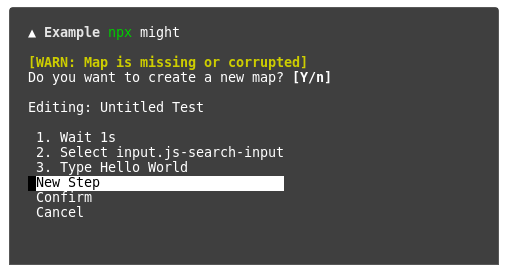

## Problem

End-to-end testing can get very complicated and can be overwhelming; especially if you want to start testing a huge app, that would take a lot of time and afford, and will boring and repetitive.

## Solution

A no-code (almost zero-config) method to perform end-to-end tests, handling most of the mess in the background.

we're working on a drop-and-drag GUI to set-up and manage all of your tests from, but for the time being, we only have the command-line interface.

## Installation
`
npm install --save-dev might-cli`

## Usage

`npx might`

When you run the command for the first time, it will walk you through all the things you need to configure:

[]()

You can set a command that starts the development server of your app, it's spawned before testing begins and terminated after the testing is done. (optional)

[]()

Then you have to provide the URL of your app. (required)

[]()

Now you have to create a few tests to run, tests are described inside a ```might.map.json``` file in the root of your project directory, the easiest way to create tests is by using [might-ui](https://github.com/ItsKerolos/Might).

Now lets say you did create a test --- The first time a test is performed, we screenshot its outcome (after all the steps) and save that screenshot inside a folder in your project directory.

[]()


When the test is performed for the second time, we again take a screenshot of its outcome but then compare it to the first-run screenshot, if both match then the test is passed, but if they mismatch then the test fails and a diff-image is created at the root of your project to show you the difference between both screenshots.

[]()


## How does it work?

Puppeteer, because of course it is, but if you're still curious, feel free to have a look at [might-core](https://github.com/ItsKerolos/might-core)'s source.
