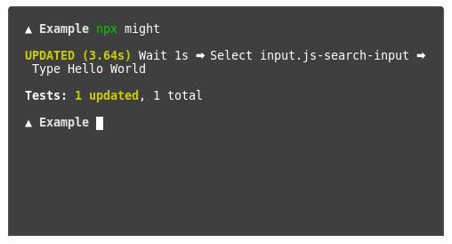
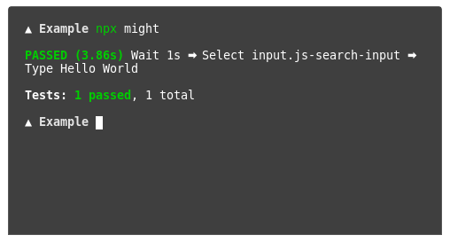

# Might

**This project is still in-development, it might be unstable.**

## The Problem

End-to-end testing can be complicated and can be overwhelming; especially if you want to start testing a huge app, that would take a lot of time and afford, and will probably cause you a few headaches.

## Our Solution

A no-code (almost zero-config) method to perform end-to-end tests, handling most of the mess in the background.

Eventually, we'll add a drop-and-drag GUI to set-up and manage all of your tests from but for the time being, we only have the command-line interface.

## Installation
`
npm install --save-dev might-cli

## Usage

`npx might`

When you run the command for the first time, it will walk you through all the things you need to configure.

You can set a command that starts the development server of your app, it's spawned before testing begins and terminated after the testing is done. (optional)

Then you have to provide the URL of your app. (required)

When that's all done you can now start creating your tests.

Add a new test, set-up a few steps then save everything.

The first time a test is performed, we screenshot its outcome (after all the steps) and save that screenshot inside a folder in your project directory.

The second time a test is performed, we again take a screenshot of its outcome but then compare it to the first-run screenshot, if both match then the test is passed, but if they mismatch the test fails and a diff-image is created at the root of your project to show you the difference between both images.

## How does it work?

Using Puppeteer, because of course it does, everything else is pretty basic, but if you're still curious, feel free to have a look at the source code.