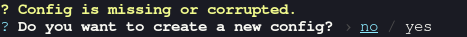
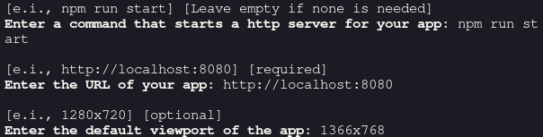
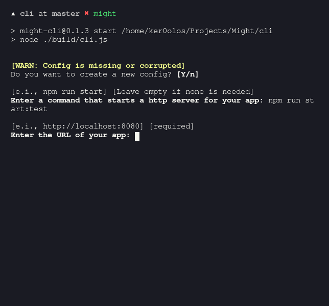
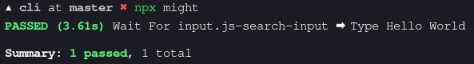

**This project is still new, issues are to be expected.**

End-to-end testing can get very complicated and overwhelming; especially if you need to start testing huge apps, that would take a lot of time and afford, and will be boring and repetitive.

### The Solution

A no-code method to perform and manage end-to-end tests, handling all of the mess in the background.

[Might UI](https://github.com/ItsKerolos/Might) is an easy way to create, manage and edit tests, and [Might CLI](https://github.com/ItsKerolos/might-cli) runs those tests.

### Installation
`
npm install --save-dev might-cli`

### Usage

`npx might`

When you run the command for the first time, it will walk you through all the things you need to configure:

1. You will be asked to set a command that starts the development server of your app, it's spawned before testing begins and terminated after the testing is done (optional).
2. The URL of the app (required).

> **More optional configurations** are available in `might.config.json`, which will be automatically generated after you finish those prompts.

---

Now you have to create a few tests to run, tests are described inside a file called `might.map.json`, the easiest way to create tests is with the help of [Might UI](https://github.com/ItsKerolos/Might).

Run `npx might -m` to open the UI regardless of it's installed or not;

> If you really want to write tests manually (not recommended) look at
> [map.md](https://github.com/ItsKerolos/might-cli/blob/master/map.md).

##### *Might UI In Action:*

---

Now that you have at least one test in `might.map.json`.

The first time each individual test is performed, its outcome (after all the steps) is screenshotted and saved inside a folder in your project directory.

When the test is performed for a second time, a new screenshot is compared with the first screenshot, if both match the test passes, but if they mismatch the test fails and an error diff-image will be created to show the difference between both screenshots).

---

run `npx might -h` to see additional information about how to run specific tests and skip the rest, how to update failed tests, how to control the amount of parallel tests, and how to get a coverage report.

#### Notes about code coverage:
We use the coverage data returned by Puppeteer, which only returns covered lines but doesn't return uncovered and ignored lines, we have some default coverage-related configs in `might.config.json` that automatically ignore certain lines, but there's always more cases like `}));` that won't be ignored by default, if you get any of those just add them to your config.

> the reports are outputted to `__coverage__`, and can be used with
> tools like codecov.

---

#### What can I test?

- Waiting
- Changing the Viewport
- Going to Different Pages.
- Setting Media Features
- Keypresses
- Hovering
- Clicking
- Dragging Elements
- Swiping the Screen
- Typing

[Want a feature that we don't have yet?](https://github.com/ItsKerolos/might-cli/issues/new?template=feature_request.md)

Any feature request related to the UI should be requested [there](https://github.com/ItsKerolos/Might/issues/new?template=feature_request.md).